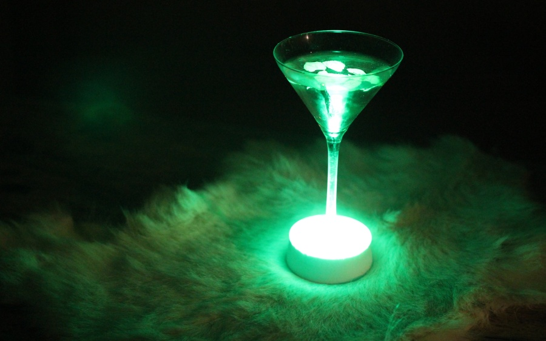
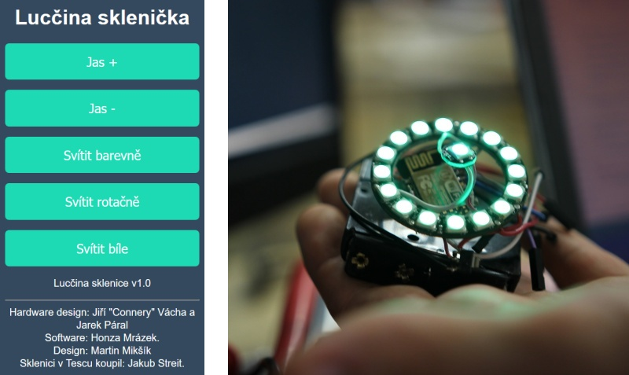

# SmartGlass

A WiFi controlled, colorful martini glass. Simple project developed during
[RoboCamp 2016](https://github.com/RoboticsBrno/RoboCamp2016) as a test project
of programming ESP8266 in Arduino environment.

## Hardware

ESP8266 in ESP-12 module is used as a main MCU. 12 + 1 WS2812B LEDs are
connected to GPIO0 and are arranged in a ring of 12 LEDS and a single center
LED. A 3D-printed pedestal for the hardware can be found in the [hw](hw)
directory. Everything is powered from 4 AAA batteries. The batteries voltage is
fed directly to the LEDs, ESP8266 is powered through 3V3 linear stabilizer.

Note for future us: We didn't use a level shifter at the LED data input. For 5 V
power supply, this is OK, however when the batteries are fully charged and the
supply voltage exceeds 5.3 V, the LEDs stop accepting data and level shifter is
needed. In the last version, simple hack with a diode on battery input was used
because of time reasons. Fix it in the next version!

## Software

Software is written in Arduino environment and supports OTA firmware update. The
first firmware flash however has to be done using serial line. See [this
document](https://github.com/esp8266/esp8266-wiki/wiki/Boot-Process) to boot
ESP-12 into firmware update mode.

## Control

Glass creates its own AP. When you connect to it, simply open a web browser and
go to "sklenicka.cz" (or any other page). The built-in DNS server should point
you to the control page. If it doesn't, your device has probably cached DNS
entries from previous connection. In that case, wait a while or go to
"192.168.1.1".

Control throug web page should be intuitive and clear. There is also a
possibility to open a socket (telnet) connection to the glass at port 12346.
Simple single character commands are provided. Note that  some software (telnet
for example) are line buffered, so you have to acknowledge every command with
newline.

## About Authors

- Hardware design: Jiří "Connery" Vácha and [Jarek Páral](https://github.com/JarekParal)
- Software: [Jan Mrázek](https://github.com/yaqwsx)
- Web page design: [Martin Mikšík](https://github.com/mamiksik)
- The glass was bought in Tesco by: Jakub Streit
